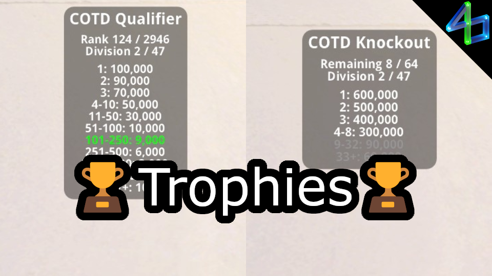

# Trophies

Tells you how many trophy points you should expect to get based on placement in a live match. Currently only works for the qualifier and knockout for each Cup of the Day, but could work for other gamemodes (i.e. Time Attack) once those are better understood.

Font, sizes, elements, and colors are all customizable. Go wild!

Requires MLFeed dependency (and therefore MLHook).

Big thanks to [THVNDR.TM](https://trackmania.io/#/player/2d05f1e4-064c-4b9f-99e8-fb28e6b658e8) for making a [spreadsheet](https://docs.google.com/spreadsheets/d/1LVioXnVeLPqwEi09SagfvXV5wZlyLS_nlimYYY4cvQM/htmlview#) outlining most things that earn trophies!

<!--  -->
<!--  -->
<!--  -->
<!--  -->
<!--  -->
<!--  -->

